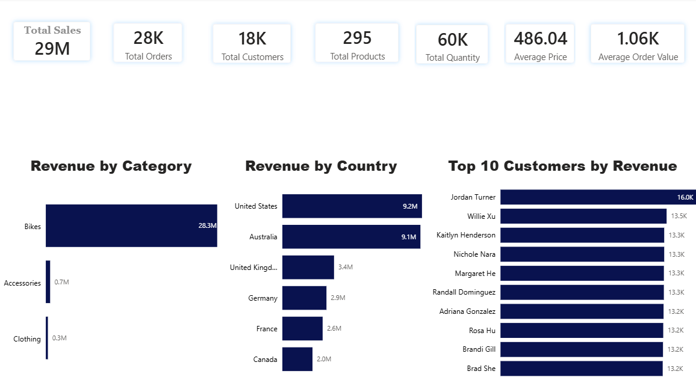

# 📊 Sales Analytics Project | SQL Server & Power BI

## Project Overview

This project demonstrates an end-to-end sales analytics solution using **SQL Server (T-SQL)** and **Power BI**. The goal is to explore a retail sales database, analyze customer and product performance, and transform raw transactional data into meaningful business insights.

The project highlights practical SQL skills used in real-world business intelligence, including data exploration, KPI reporting, customer analysis, product performance analysis, and dashboard development.

---

## Business Objective

This analysis answers key business questions, including:

- Which countries generate the highest revenue?
- Which product categories contribute the most to total sales?
- Who are the highest-value customers?
- Which products perform the best and worst?
- What are the company's key sales KPIs?
- How can these insights support better business decisions?

---

## Dashboard


```

The Power BI dashboard summarizes key business metrics, including:

- Total Sales
- Total Orders
- Total Customers
- Total Products
- Total Quantity Sold
- Average Product Price
- Average Order Value
- Revenue by Category
- Revenue by Country
- Top Customers by Revenue

---

## Database Schema

The project uses a simple **star schema** consisting of one fact table and two dimension tables.

```text
                dim_customers
                      │
                      │ CustomerID
                      │
                 fact_sales
                      │
                      │ ProductID
                      │
                dim_products
```

### Tables

| Table | Description |
|-------|-------------|
| **fact_sales** | Sales transactions |
| **dim_customers** | Customer information |
| **dim_products** | Product information |

---

## Technologies Used

- SQL Server
- T-SQL
- SQL Server Management Studio (SSMS)
- Power BI
- Git
- GitHub

---

## SQL Skills Demonstrated

- SELECT
- WHERE
- GROUP BY
- ORDER BY
- HAVING
- INNER JOIN
- LEFT JOIN
- Aggregate Functions
- CASE WHEN
- Common Table Expressions (CTEs)
- Window Functions
- ROW_NUMBER()
- RANK()
- DENSE_RANK()
- Subqueries
- Data Aggregation
- Business KPI Analysis

---

## Project Structure

```text
sales-analytics-project
│
├── SQL
│   ├── 01_Database_Exploration.sql
│   ├── 02_Dimension_Exploration.sql
│   ├── 03_Date_Analysis.sql
│   ├── 04_Measures.sql
│   ├── 05_Magnitude_Analysis.sql
│   └── 06_Ranking_Analysis.sql
│
├── Dashboard
│   └── Sales Dashboard.pbix
│
├── Images
│   └── dashboard.png
│
└── README.md
```

---

## SQL Analysis

### Database Exploration

- Inspected database tables and columns
- Reviewed table structures
- Examined relationships between tables

### Dimension Exploration

- Product Categories
- Product Subcategories
- Customer Countries
- Customer Segments

### Date Analysis

- First Order Date
- Last Order Date
- Customer Age Range

### Measures & KPIs

Calculated:

- Total Sales
- Total Orders
- Total Customers
- Total Products
- Total Quantity Sold
- Average Product Price
- Average Order Value

### Magnitude Analysis

Analyzed:

- Revenue by Category
- Revenue by Country
- Revenue by Customer
- Customers by Country
- Customers by Gender
- Products by Category

### Ranking Analysis

Identified:

- Top 5 Products by Revenue
- Bottom 5 Products by Revenue
- Top 10 Customers by Revenue
- Bottom Customers by Number of Orders

---

## Key Insights

- Bikes generated the majority of total revenue, making them the company's strongest-performing product category.
- The United States and Australia were the highest revenue-generating markets.
- A relatively small group of customers contributed a significant share of overall sales.
- Customer spending varied considerably, highlighting opportunities for customer segmentation and targeted marketing.
- The dashboard provides a clear overview of business performance through essential KPIs.

---

## Business Recommendations

Based on the analysis:

- Increase marketing investment in the Bikes category.
- Expand sales initiatives in high-performing countries.
- Introduce loyalty programs for high-value customers.
- Review pricing and promotional strategies for lower-performing product categories.
- Monitor business performance using interactive Power BI dashboards.

---

## Future Improvements

- Add monthly and yearly sales trend analysis
- Build a fully interactive Power BI dashboard with slicers
- Perform RFM customer segmentation
- Forecast future sales trends
- Calculate additional KPIs such as Profit Margin and Return Rate

---

## How to Run

1. Open **SQL Server Management Studio (SSMS)**.
2. Restore or create the **DataWarehouseAnalytics** database.
3. Import the following tables:
   - `dim_customers`
   - `dim_products`
   - `fact_sales`
4. Run the SQL scripts in sequence.
5. Open the Power BI dashboard to explore the visualizations.

---

## About

This project was developed as part of my Data Analytics portfolio to demonstrate practical SQL Server and Power BI skills. It showcases my ability to explore relational databases, analyze business data, build meaningful KPIs, and present actionable insights through interactive dashboards.

If you found this project interesting, feel free to connect with me or explore my other projects on GitHub.
